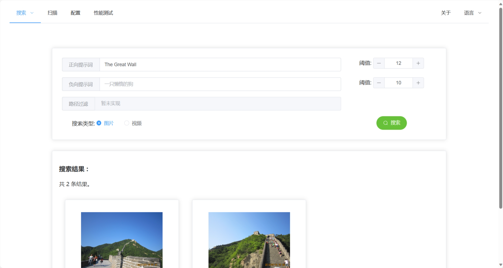
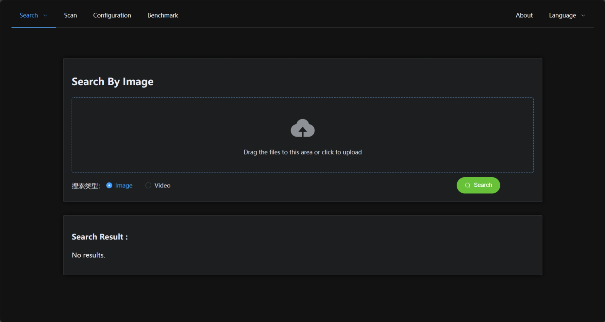
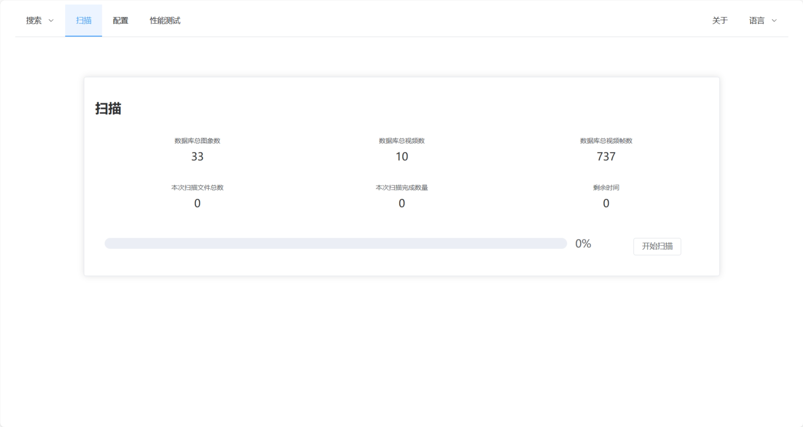
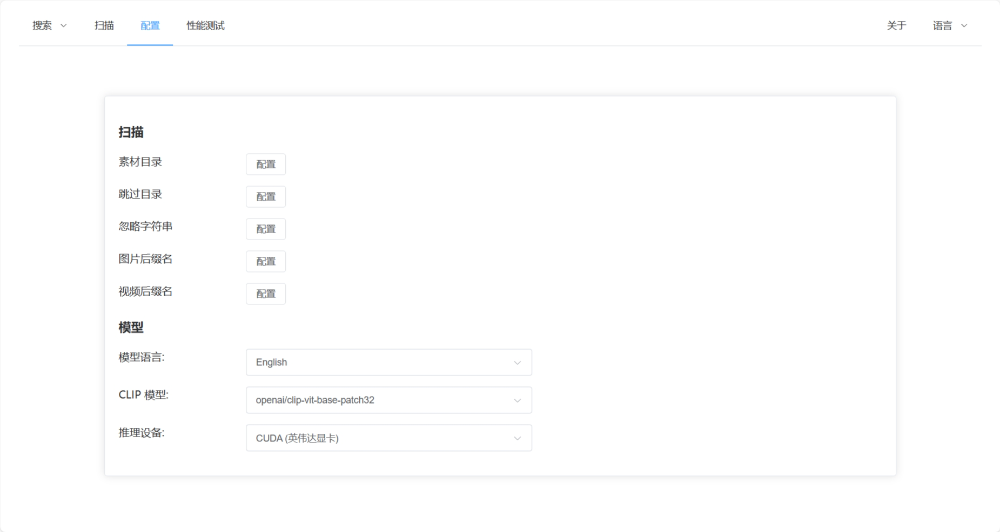

# MaterialSearch WebUI 

A Web UI of [chn-lee-yumi/MaterialSearch](https://github.com/chn-lee-yumi/MaterialSearch) project.

## Feature
- [x] search image / video using natural language
- [x] search image / video using image
- [x] scan
- [x] benchmark
- [x] i18n
- [x] dark mode
- [ ] configuration (TODO)
- [ ] login (TODO)

## Preview








## Usage
Copy all files from the `dist/` directory after build to the `static/` directory of the MaterialSearch project.

## Configuration
Modify the `restApiBaseUrl` and `wsApiBaseUrl` in the `config.json` file to the backend address.

```json
{
    "restApiBaseUrl": "http://127.0.0.1:8085/api",
    "wsApiBaseUrl": "ws://127.0.0.1:8085/api/ws"
}
```
## Development

Configure the MaterialSearch project：

Modify the `allowOrigins` in the `config/server.json` file, to development server address to avoid cross-origin issues.

```json
{
    "allowOrigins": [
        "http://localhost:5173",
        "http://127.0.0.1:5173",
    ],
    ...
}
```

Then start API server.

```
python fastapi_main.py 
```

Install dependencies: 
```bash
yarn 
```

Start development server:
```bash
yarn run dev 
```

Build：
```bash
yarn run build
```
